# 📝 Mini Word

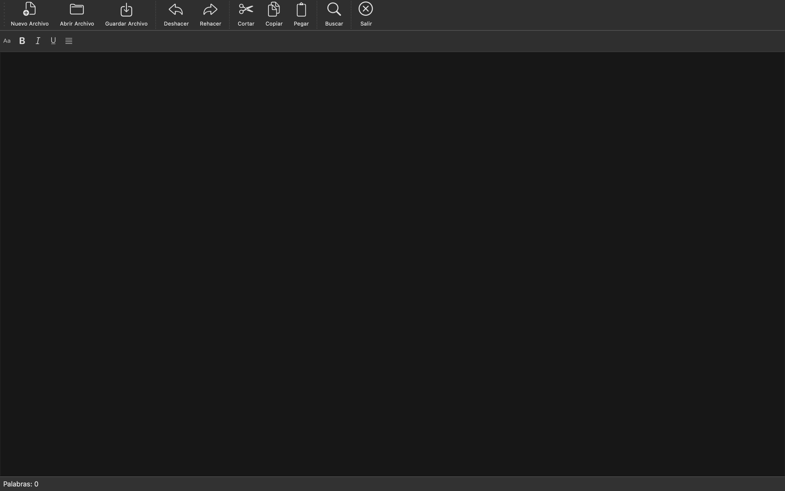

**Mini Word** es un editor de texto ligero desarrollado con **PySide6 (Qt for Python)**.
Incluye funcionalidades básicas de edición, búsqueda, reemplazo y formato de texto, con una interfaz gráfica moderna y fácil de usar.

---

## 🚀 Características principales

✅ **Gestión de archivos**

* Crear nuevos documentos
* Abrir archivos `.txt`
* Guardar con nombre personalizado
* Confirmación para guardar cambios antes de salir

✅ **Edición básica**

* Deshacer / Rehacer
* Cortar, Copiar, Pegar

✅ **Búsqueda y reemplazo**

* Panel lateral tipo *dock* para buscar y reemplazar texto
* Resaltado automático de coincidencias
* Función de “Buscar siguiente” y “Reemplazar todo”

✅ **Formato de texto**

* Cambiar fuente y tamaño
* Aplicar **negrita**, *cursiva*, y *subrayado*
* Seleccionar color de fondo del texto
* Botones con iconos en una barra de formato

✅ **Interfaz**

* Barras de herramientas personalizadas
* Contador de palabras en la barra de estado
* Diálogos de confirmación al crear o cerrar archivos
* Diseño adaptable con *dock widgets*

---

## ⚙️ Requisitos

* **Python 3.8+**
* **PySide6**

---

## 🛠️ Instalación y entorno de desarrollo

Para trabajar con **Mini Word** de forma segura y reproducible, se recomienda usar **pipenv**, que gestiona un entorno virtual y las dependencias del proyecto.

### 1️⃣ Crear el entorno virtual

En la carpeta del proyecto:

```bash
pipenv --python 3
```

Esto creará un entorno virtual específico para este proyecto y generará un `Pipfile` para controlar las dependencias.

---

### 2️⃣ Activar el entorno virtual

Para entrar en el entorno virtual:

```bash
pipenv shell
```

Verás que el prompt de la terminal muestra el nombre del entorno. Para salir del entorno:

```bash
deactivate
```

---

### 3️⃣ Instalar dependencias

Con el entorno activo, instala las librerías necesarias:

```bash
pipenv install PySide6 pyinstaller
```

Opcionalmente, si quieres usar Pillow para iconos o manipulación de imágenes:

```bash
pipenv install Pillow
```

---

### 4️⃣ Ejecutar la aplicación en desarrollo

Mientras estás en el entorno virtual:

```bash
python main.py
```

Esto ejecutará la aplicación sin necesidad de empaquetarla.

---

### 5️⃣ Crear un ejecutable para macOS

Para generar una aplicación nativa `.app` en macOS, usando PyInstaller:

```bash
pyinstaller \
  --windowed \
  --name MiniWord \
  --icon=imagesMO/iconoApp.icns \
  --add-data "imagesMO:imagesMO" \
  main.py
```

* `--windowed` → Evita que se abra la terminal junto con la app.
* `--name MiniWord` → Nombre de la aplicación.
* `--icon` → Icono de la ventana principal (debe ser `.icns` en macOS).
* `--add-data` → Incluye la carpeta de imágenes dentro del ejecutable.

El resultado se encontrará en:

```
dist/MiniWord.app
```

Y podrás abrir la aplicación como cualquier otra app de macOS.

---

### 6️⃣ Reproducir el entorno en otra máquina

Si se comparte el proyecto, basta con clonar el repositorio y ejecutar:

```bash
pipenv install
pipenv shell
python main.py
```

Esto asegura que se instalen las mismas versiones de las dependencias definidas en el `Pipfile.lock`.

---

## 📂 Estructura del proyecto

```
mini-word/
│── (otros ejercicios)
├── main.py                  # Código principal de la aplicación
├── imagesMO/
│   ├── iconoApp.icns        # Icono de la ventana principal
│   └── logo.png             # Imagen de ejemplo para la interfaz
├── Pipfile                  # Gestión de dependencias
└── README.md                # Documentación del proyecto
```


---

## 📃 Creación del Certificado Digital

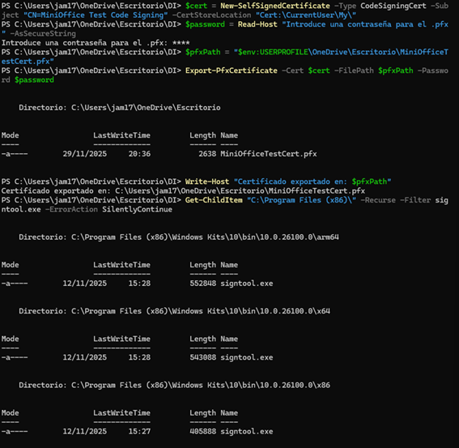

Se generó un certificado tipo *Code Signing* mediante PowerShell:

```powershell
$cert = New-SelfSignedCertificate -Type CodeSigningCert `
-Subject "CN=MiniOffice Test Code Signing" `
-CertStoreLocation "Cert:\CurrentUser\My"
```

---

## 📜 Firma Digital del Ejecutable MiniWord.exe

```powershell
Get-ChildItem "C:\Program Files (x86)" -Recurse -Filter signtool.exe
```

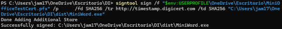

```powershell
signtool sign /f MiniOfficeTestCert.pfx /fd SHA256 /tr http://timestamp.digicert.com
```

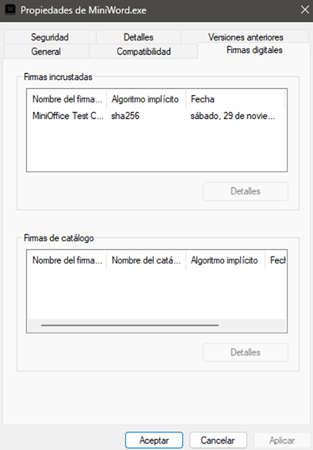

---

## 🔩 Creación del Instalador con Inno Setup

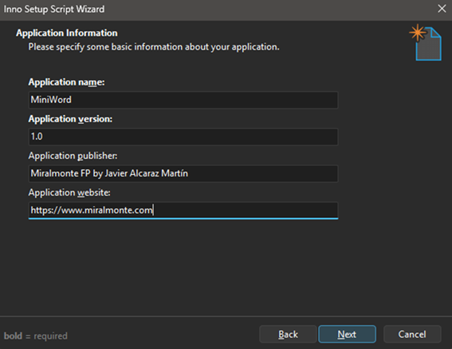

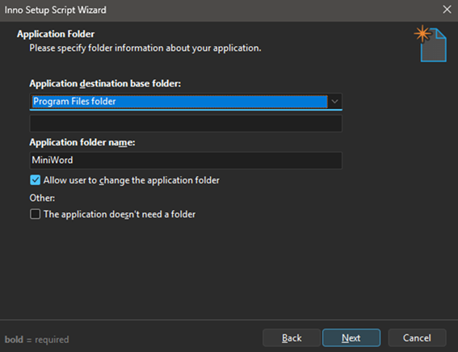

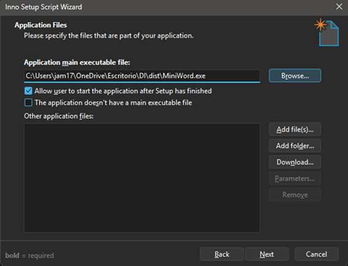

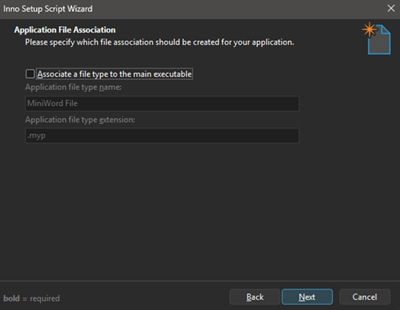

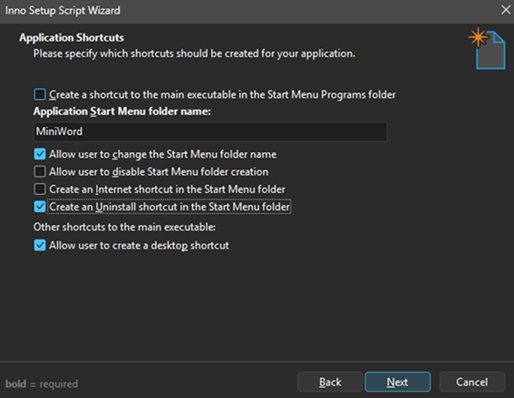

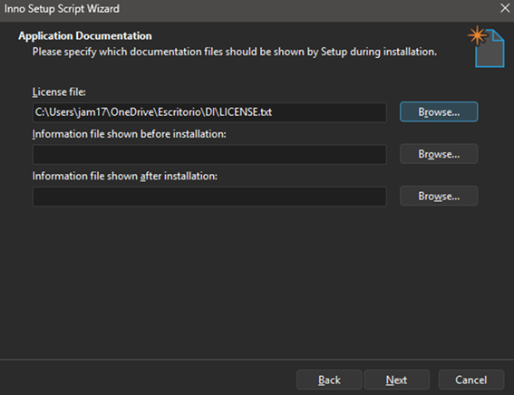

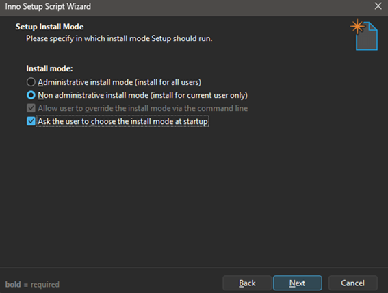

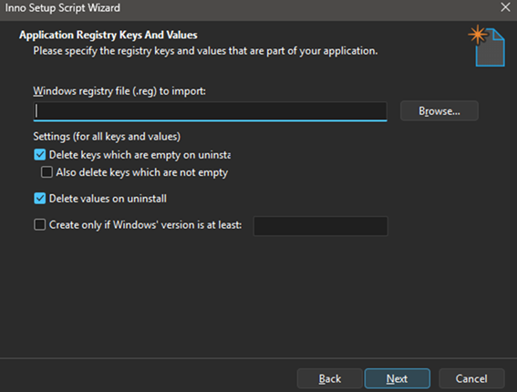

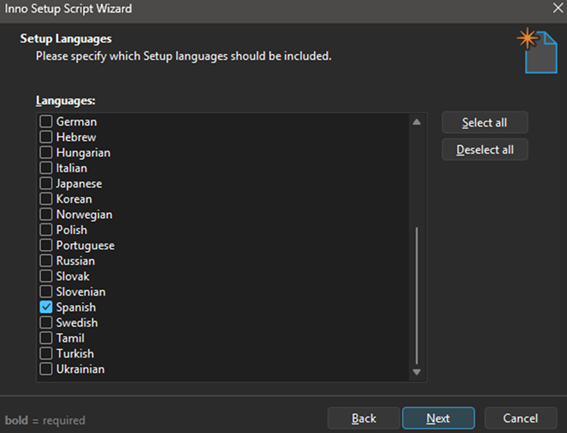

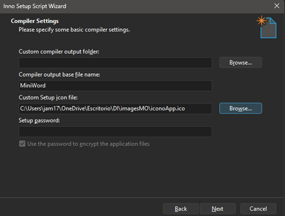


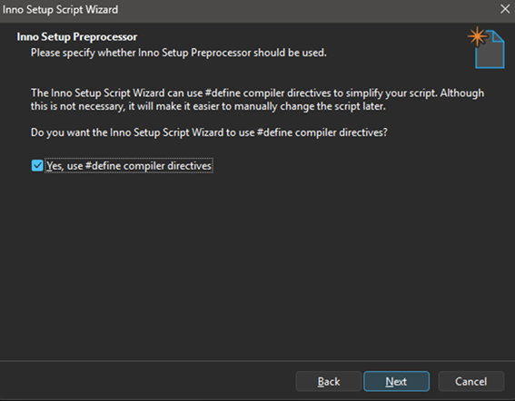

---

## 💻 Creación del Instalador con Inno Setup

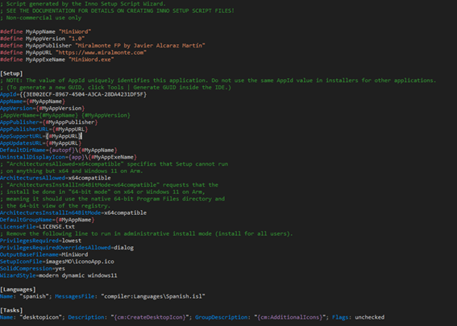

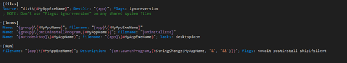

---

## 👁️‍🗨️ Pruebas de Instalación

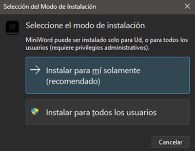

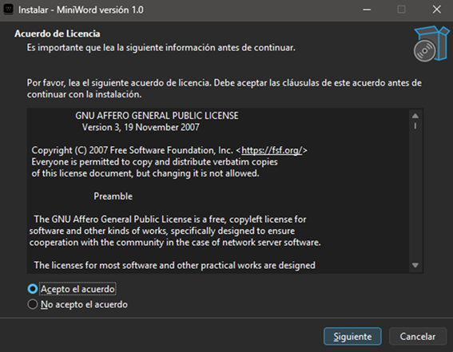

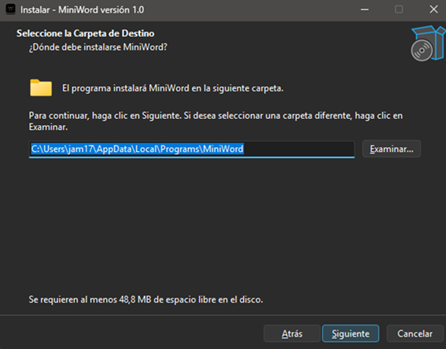

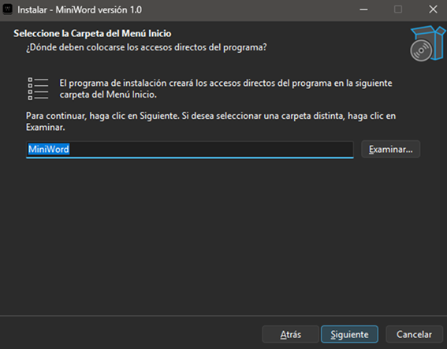

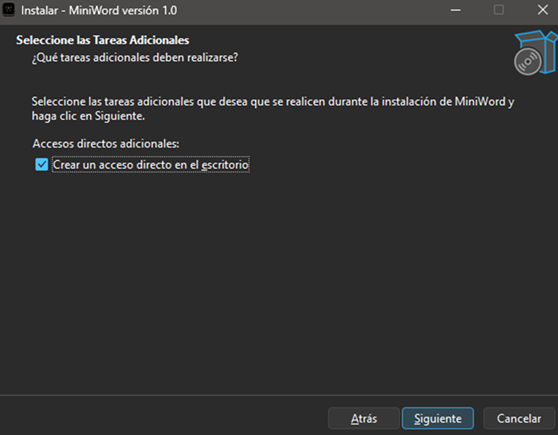


---

## ✅ 6. Comprobación tras la instalación

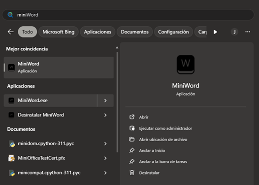

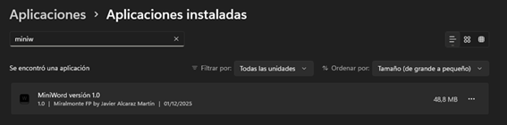

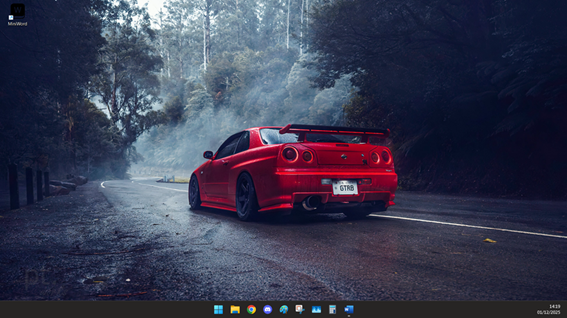

---

## 💡 Funciones destacadas del código

* **crearAccion()** → Simplifica la creación de acciones con atajos e iconos.
* **crearBoton()** → Genera botones de formato personalizados con efectos hover.
* **buscarPalabra() / reemplazarTexto()** → Implementan la lógica de búsqueda avanzada con resaltado.
* **aplicarFuente(), aplicarNegrita(), aplicarCursiva(), aplicarBackground()** → Controlan el formato del texto.
* **popUpNew() y popUpExit()** → Muestran ventanas emergentes para guardar antes de crear o cerrar archivos.

---

## **Señales y su implementación**

Esta sección documenta las señales principales usadas en la aplicación y dónde están implementadas en el código (`MiniOffice.py`). Para ver el código, sigue los enlaces a las líneas relevantes.

- **Señal**: `recognized_text` — Señal personalizada que emite el texto reconocido por el subproceso de reconocimiento de voz. Definida en [MiniOffice.py](MiniOffice.py#L14), conectada a `procesarTextoVoz` en [MiniOffice.py](MiniOffice.py#L37) y emitida desde el hilo de escucha en [MiniOffice.py](MiniOffice.py#L769).
- **Señal**: `visibilityChanged` — Señal del `QDockWidget` `dockBuscar` que se conecta a `cerrarDockBuscar` cuando cambia la visibilidad. Conexión en [MiniOffice.py](MiniOffice.py#L191).
- **Señal**: `textChanged` de `QLineEdit` (`txtBuscar`) — Usada para disparar la búsqueda y el resaltado en tiempo real mediante `buscarPalabra`. Conexión en [MiniOffice.py](MiniOffice.py#L239).
- **Señal**: `clicked` de botones de búsqueda y reemplazo — `btnBuscarSiguiente`, `btnBuscarAnterior`, `btnReemplazar`, `btnReemplazarTodo` están conectados respectivamente a `buscarSiguientePalabra`, `buscarAnteriorPalabra`, `reemplazarTexto`, `reemplazarTodoTexto`. Conexiones en [MiniOffice.py](MiniOffice.py#L240-L243).
- **Señal**: `textChanged` de `QTextEdit` (`doc`) — Actualiza el `WordCounterWidget` mediante una lambda que llama a `update_from_text`. Conexión en [MiniOffice.py](MiniOffice.py#L311).
- **Señal**: `triggered` de `QAction` — Todas las acciones creadas con `crearAccion()` conectan su `triggered` al método pasado (ej.: abrir, guardar, salir). Implementación de la conexión en [MiniOffice.py](MiniOffice.py#L328).
- **Señal**: `clicked` de botones generados por `crearBoton()` — En el helper `crearBoton()` cada `QPushButton` conecta su `clicked` al método correspondiente (ej.: aplicar formatos). Implementación en [MiniOffice.py](MiniOffice.py#L351).

Notas rápidas:
- Las señales del framework (como `clicked`, `textChanged`, `visibilityChanged`, `triggered`) se conectan a handlers en el hilo principal para mantener la seguridad de la GUI.
- La señal personalizada `recognized_text` se usa para pasar texto desde el hilo de reconocimiento de voz al hilo principal de la GUI de forma segura (emitida en el hilo de escucha y conectada al método `procesarTextoVoz`).

## 📄 Licencia

**GNU Affero General Public License v3 (AGPL-3.0)**

## 🧑‍💻 Autor

**Desarrollado por:** *[Javier Alcaraz Martín]*
💼 Proyecto educativo desarrollado con **PySide6** en **Python**.

---

## 📜 Licencia

Este proyecto se distribuye bajo la licencia **MIT**.
Consulta el archivo [LICENSE](LICENSE) para más detalles.
